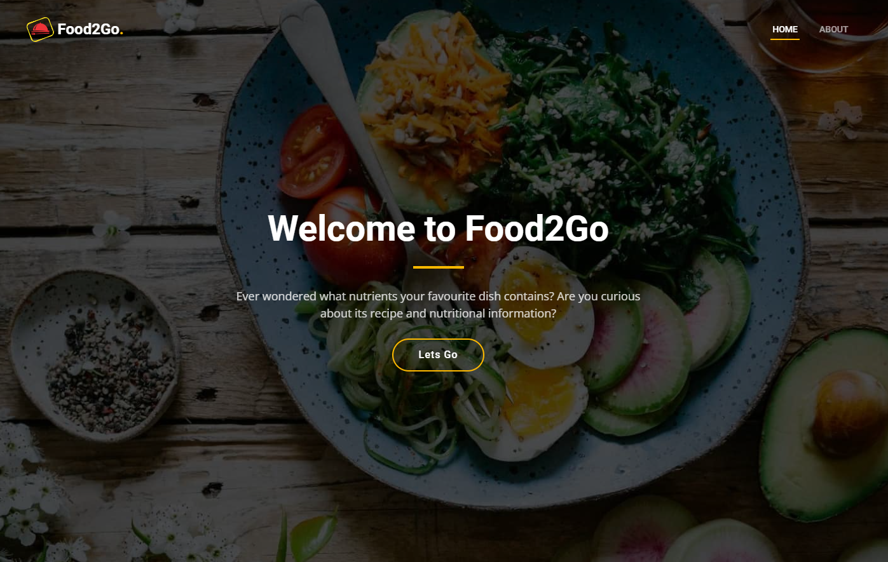
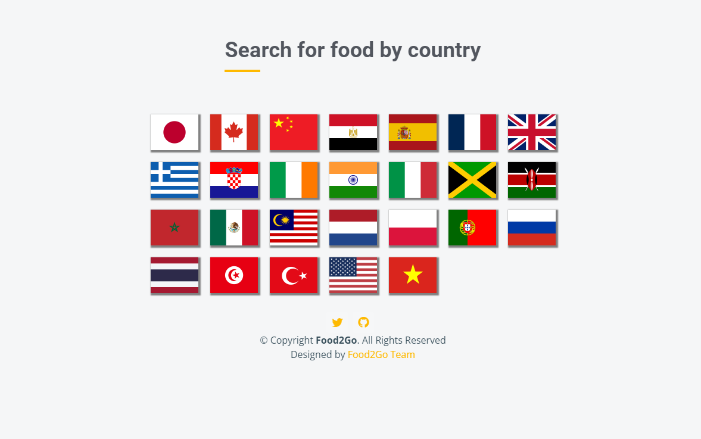
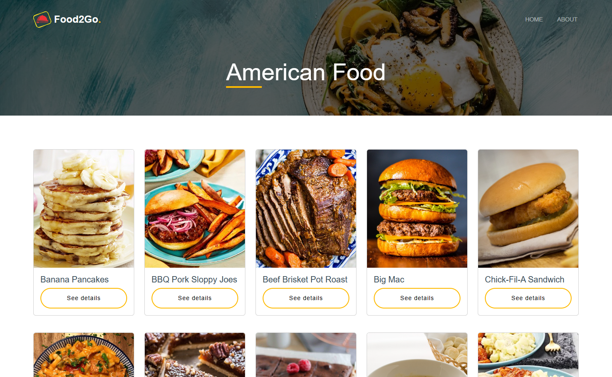
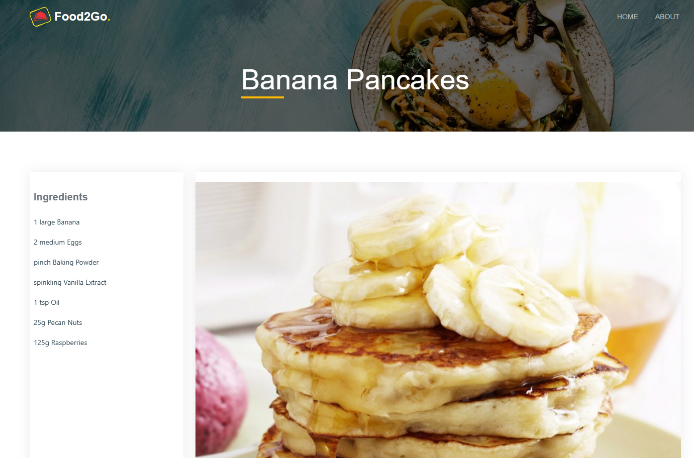
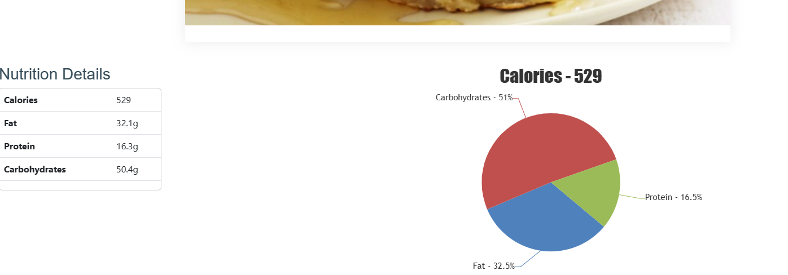

# Food2Go - Recipe and Nutritional information

## Links

- Live app: https://mandipn.github.io/Food2Go/
- One Pager: https://docs.google.com/document/d/1fOwsFL8KyQnmG9vf7lDlg5IxsVvdX17G/edit?usp=sharing&ouid=114955040654377976214&rtpof=true&sd=true
- Wireframe: https://docs.google.com/presentation/d/1IU1wKK8g2Zgqs36kebJsoxBFFEquNt9j9f2fuoc7_Jc/edit?usp=sharing
- Presentation: https://docs.google.com/presentation/d/1GOMU27_VVYszFoppcfT7RqsZc3Tjvfb5d65cpI-Il-o/edit?usp=sharing

## Description

When travelling it isn't always easy to find ingredients and nutritional information about the local dishes. That's where Food2Go comes in.
Food2Go is a single page application that allows a user to choose a country and see dishes from that country. When a specific dish is chosen, a list of ingredients and nutritional information is displayed.

## Screenshots

## User Story

As a user, I would like to be able to quickly identify meals from a specific country with the ingredients list and the nutrition information.
As a user:

- I would like to visit an application where I can easily get the above information.
- I would like the interface to be user friendly and to be able to access it through multiple platforms.
- I would like to be able select from a list of flags of countries by clicking on a flag.
- I would then like to be presented with top 2 meals for that country.
- I would then like to be able to choose a meal, click on the meal and be presented with the nutrition information.

## Technologies Used

- HTML
- CSS
- JavaScript
- jQuery
- theMealDb API - used to fetch the meal data and images
- Edamam API - used to fetch the nutritional data for each recipe
- Bootstrap - used for styling the app

## Challenges in developing the app

There were plenty of challenges in getting the app to work. The biggest challenge was retrieving the data from the first API and manipulating it in a way that it could then be used to call the second API

## Credits

- Mandip - https://github.com/mandipn
- Hibaag - https://github.com/hibz87
- Billy - https://github.com/goloobab
- David - https://github.com/Daveym1
